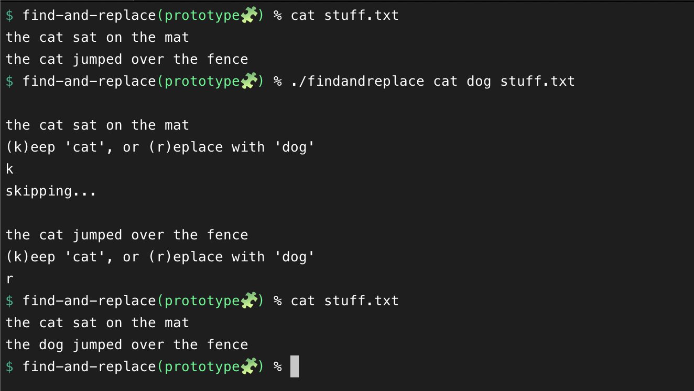

# find-and-replace
A line by line find-and-replace CLI tool driven by ripgrep and sed

## Prerequisites

This tools uses ripgrep to find strings to replace, so it needs to be installed
https://github.com/BurntSushi/ripgrep

## Caveats

Currently implemented against GNU sed as this tool was written on Mac

## Inspiration

IDEs like Intellij and VS Code have good line-by-line find and replace capabilities.
But I couldn't find such a tool for the terminal, so i made one :) 

Inspiration from the interface comes Git's add/restore `-p` functionality, where you can add/restore a chunk, one at a time.

## Usage 
```shell
go build .

./findandreplace [string-to-remove] [string-to-replace] [file]
```

`k + Enter` to keep
`r + Enter` to replace


